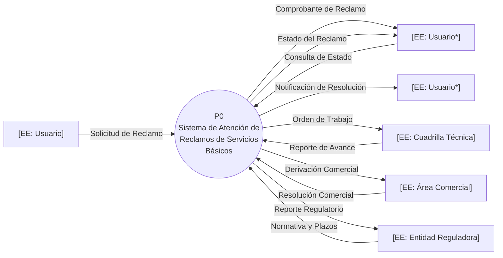

# DFD Nivel 0: Diagrama de Contexto — Sistema de Atención de Reclamos de Servicios Básicos

## Contexto

El sistema recibe reclamos de los usuarios (cortes, facturación, fugas, fallas técnicas), los procesa internamente y coordina con cuadrillas técnicas y el área comercial hasta la resolución y cierre dentro de los plazos regulatorios. La entidad reguladora aporta la normativa de plazos y recibe reportes periódicos.

**Frontera del sistema (Modelo Ambiental):** las delegaciones con las cuadrillas, el área comercial y el usuario se modelan como Entidades Externas. Los reclamos entran por cualquier canal (presencial, telefónico, web) y todos quedan igualmente sujetos a clasificación, asignación y plazo regulatorio.

## Diagrama

📌 Leyenda del Diagrama
[EE: ...] = Entidad Externa (actor/fuente/destino fuera del sistema)
P0((...)) = Proceso (transformación o acción del sistema)
[(AD: ...)] = Almacén de Datos (datos en reposo)
-->|...| = Flujo de Datos (información en movimiento)

## Flujos principales

| Flujo | Origen → Destino | Observación |
|-------|------------------|-------------|
| Solicitud de Reclamo | Usuario → P0 | F1 |
| Comprobante de Reclamo | P0 → Usuario | F1 (respuesta) |
| Consulta de Estado | Usuario → P0 | F2 |
| Estado del Reclamo | P0 → Usuario | F2 (respuesta) |
| Notificación de Resolución | P0 → Usuario | fin de ciclo |
| Orden de Trabajo | P0 → Cuadrilla Técnica | F3 (solicitante) |
| Reporte de Avance | Cuadrilla Técnica → P0 | F3 |
| Derivación Comercial | P0 → Área Comercial | F4 (solicitante) |
| Resolución Comercial | Área Comercial → P0 | F4 |
| Normativa y Plazos | Entidad Reguladora → P0 | F5 |
| Reporte Regulatorio | P0 → Entidad Reguladora | T2 |

## Puntos Clave

- La **entidad reguladora es un suministro externo** (normativa) y a la vez destino de reportes: en Yourdon esto se resuelve con una única Entidad Externa y dos flujos, uno de entrada y uno de salida.
- **Los usuarios se muestran duplicados** (asterisco) exclusivamente por legibilidad; es la misma entidad lógica.
- No existen almacenes de datos en el Nivel 0: la frontera solo expone el flujo de entrada/salida, manteniendo el balanceo con el Nivel 1.