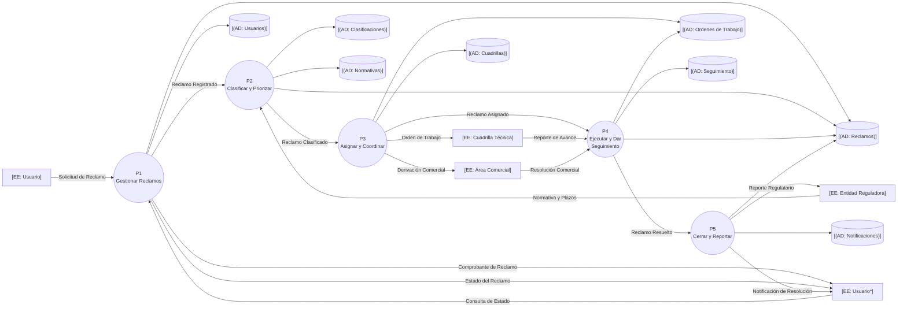

# DFD Nivel 1: Subsistemas — Sistema de Atención de Reclamos de Servicios Básicos

## Contexto

El proceso de contexto P0 se descompone en cinco subsistemas con responsabilidades separadas por fase del ciclo de vida del reclamo. Las Entidades Externas permanecen y todos los flujos del nivel padre se conservan (balanceo estricto). Los almacenes de datos compartidos se muestran con el mismo nombre en todos los niveles.

## Diagrama

📌 Leyenda del Diagrama
[EE: ...] = Entidad Externa (actor/fuente/destino fuera del sistema)
P1((...)) = Proceso (transformación o acción del sistema)
[(AD: ...)] = Almacén de Datos (datos en reposo)
-->|...| = Flujo de Datos (información en movimiento)

## Descomposición funcional

| Proceso | Responsabilidad Yourdon | Salidas |
|---------|-------------------------|---------|
| P1 Gestionar Reclamos | Captura la frontera: recepción, registro, comprobante y consultas del usuario | Reclamo Registrado, Comprobante, Estado del Reclamo |
| P2 Clasificar y Priorizar | Transforma el reclamo en hechos clasificados: tipo, urgencia y plazo | Reclamo Clasificado |
| P3 Asignar y Coordinar | Convierte el reclamo en compromisos externos: cuadrilla o área comercial | Reclamo Asignado, Orden de Trabajo, Derivación Comercial |
| P4 Ejecutar y Dar Seguimiento | Consume los reportes de ejecución y vigila vencimientos y críticos | Reclamo Resuelto |
| P5 Cerrar y Reportar | Cierra el caso, notifica al usuario y emite reportes reguladores | Notificación, Reporte Regulatorio |

## Puntos Clave

- **El flujo padre→hijo se conserva**: los 12 flujos del contexto aparecen en este nivel (verificación de balanceo).
- **Los comprobantes y estados de consulta no alteran el caso**: son respuestas puramente de P1, ajenas a la clasificación posterior.
- **Los almacenes nacen en este nivel** y permanecen con nombre idéntico en niveles inferiores, conforme a Yourdon.
- El desarrollo de reclamos asíncrono (trabajo de campo de una cuadrilla) **requiere el almacén intermedio AD: Ordenes de Trabajo** para no romper el flujo sincrónico.