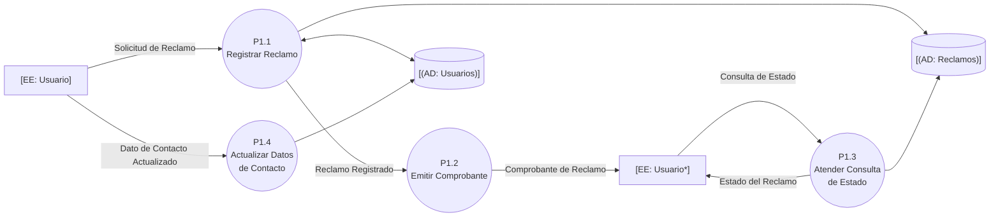
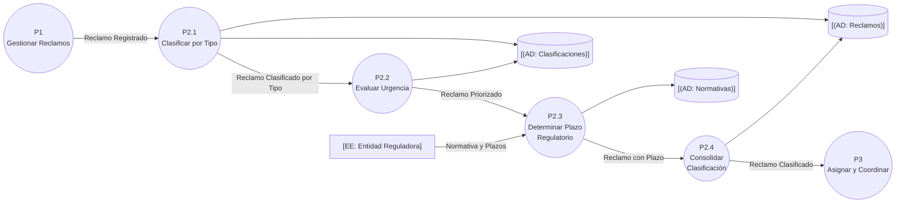
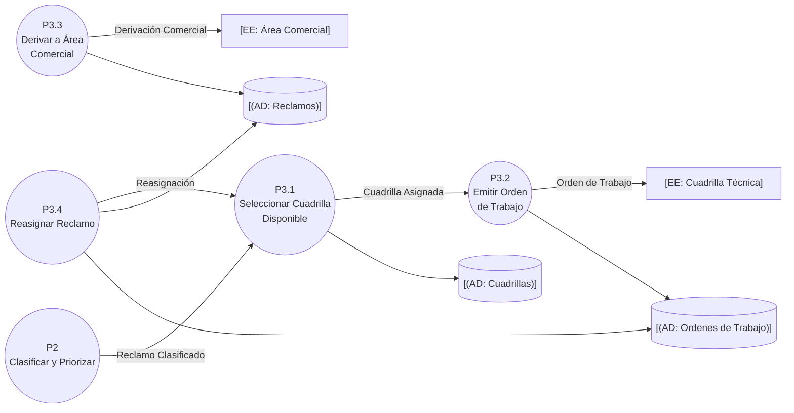
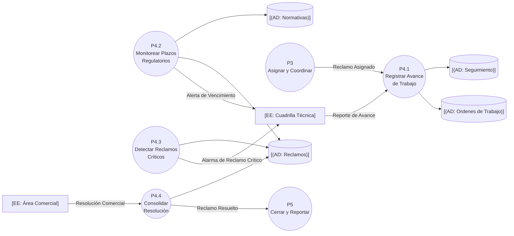
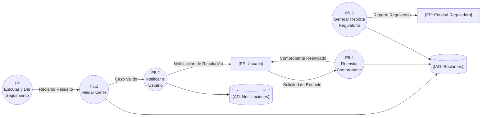

# DFD Nivel 2: Funciones — Sistema de Atención de Reclamos de Servicios Básicos

## Contexto

Cada subsistema del Nivel 1 se descompone en funciones (P1.1, P2.1, …). Los flujos externos del nivel padre se conservan asociados a la función que los toca (balanceo estricto).

## P1 — Gestionar Reclamos

## P2 — Clasificar y Priorizar

## P3 — Asignar y Coordinar

## P4 — Ejecutar y Dar Seguimiento

## P5 — Cerrar y Reportar

📌 Leyenda del Diagrama
[EE: ...] = Entidad Externa (actor/fuente/destino fuera del sistema)
P1.1((...)) = Proceso (transformación o acción del sistema)
[(AD: ...)] = Almacén de Datos (datos en reposo)
-->|...| = Flujo de Datos (información en movimiento)

## Puntos Clave

- **P2.3 depende de la Entidad Reguladora** para convertir normativa en plazo concreto; sin la normativa no se fija fecha límite.
- **P4.2 y P4.3 son los eventos temporales y de control del modelo**: leen el repositorio y disparan la alerta/ alarma hacia la cuadrilla sin intervención del usuario.
- **P5.4** atiende el evento de control C3 (reimpresión de comprobante) sin alterar el caso.
- La reasignación (P3.4) realimenta la selección de cuadrilla, manual o automática, según disponibilidad.