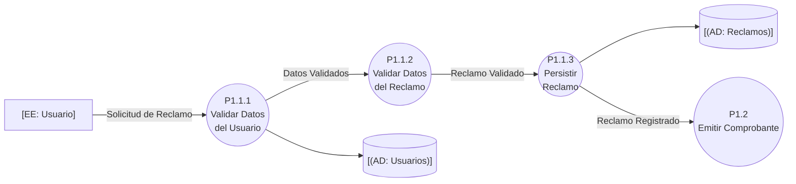
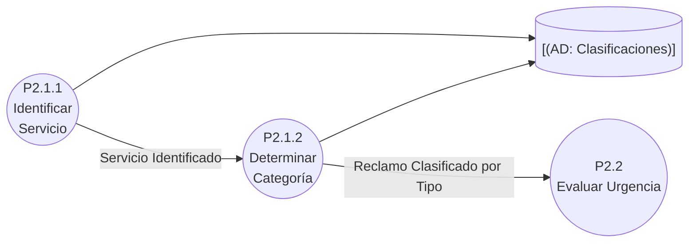
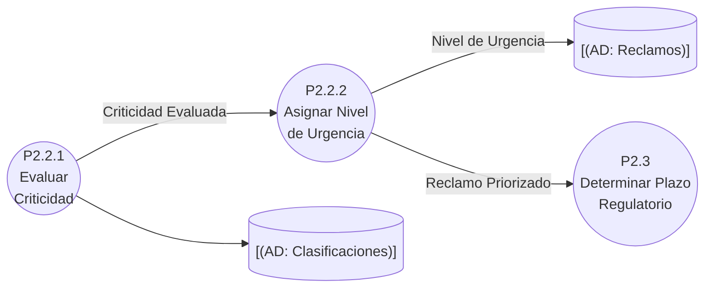
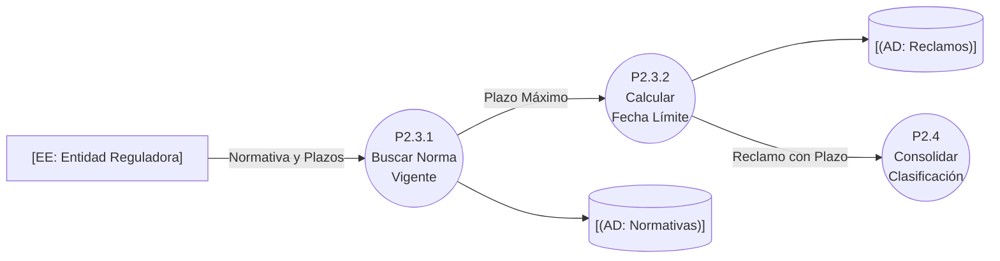
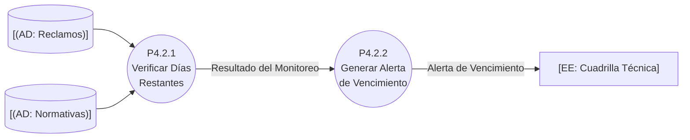
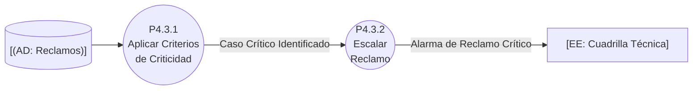
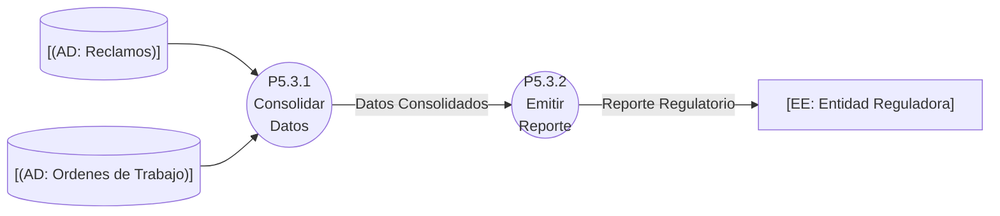

# DFD Nivel 3: Subfunciones / Eventos — Sistema de Atención de Reclamos de Servicios Básicos

## Contexto

Descomposición de las funciones con lógica significativa. Quedan aquí los procesos que materializan los eventos (F, T, C) del Modelo Ambiental: registro, clasificación, urgencia, plazo, monitoreo, criticidad y reporte.

## P1.1 — Registrar Reclamo (evento F1)

## P2.1 — Clasificar por Tipo

## P2.2 — Evaluar Urgencia

## P2.3 — Determinar Plazo Regulatorio (evento F5)

## P4.2 — Monitorear Plazos Regulatorios (eventos T1 / C1)

## P4.3 — Detectar Reclamos Críticos (evento C2)

## P5.3 — Generar Reporte Regulatorio (evento T2)

📌 Leyenda del Diagrama
[EE: ...] = Entidad Externa (actor/fuente/destino fuera del sistema)
P2.1.1((...)) = Proceso (transformación o acción del sistema)
[(AD: ...)] = Almacén de Datos (datos en reposo)
-->|...| = Flujo de Datos (información en movimiento)

## Puntos Clave

- **Los eventos del Modelo Ambiental quedan mapeados**: F1 (P1.1), F5 (P2.3), T1/C1 (P4.2), C2 (P4.3), T2 (P5.3).
- **Cada bloque conserva los flujos E/S de su proceso padre** (P2.2 recibe "Reclamo Clasificado por Tipo" y entrega "Reclamo Priorizado"; P4.3 recibe y produce lo mismo que P4.3 del Nivel 2).
- **P4.2 es indiferente a relojes del mundo**: dispara únicamente comparando fecha límite contra la fecha actual, según Yourdon (es un evento temporal puro).