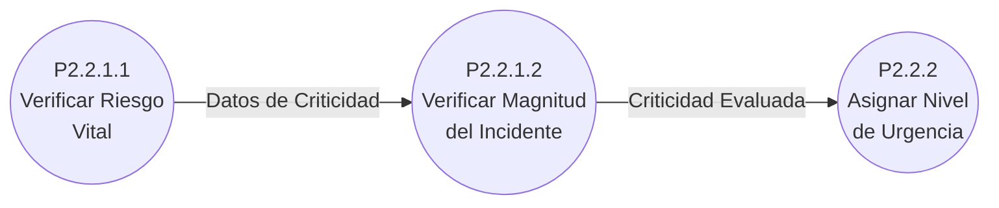
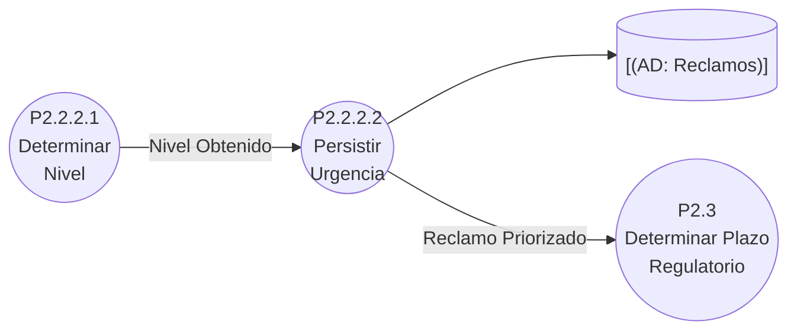
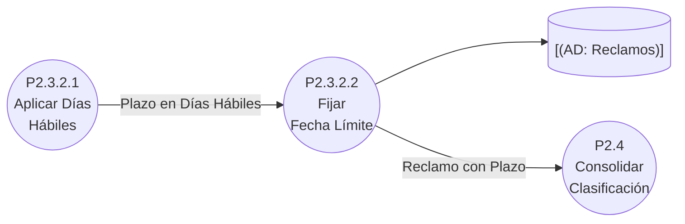
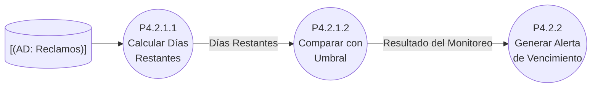
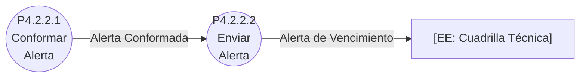
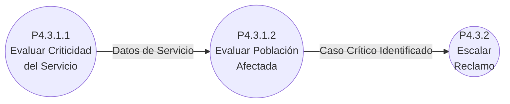
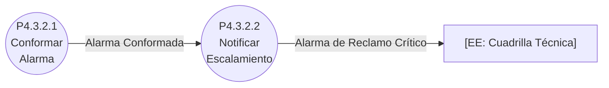
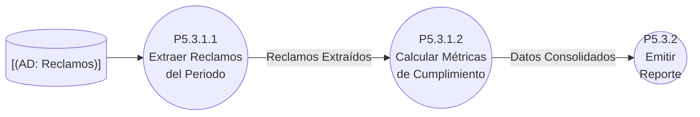

# DFD Nivel 4: Procesos Primitivos — Sistema de Atención de Reclamos de Servicios Básicos

## Contexto

Hojas del árbol de descomposición: cada proceso de este nivel es un **proceso primitivo** con especificación propia en [especificaciones.md](especificaciones.md). Solo se llega a Nivel 4 en la lógica que concentra reglas de negocio (urgencia, plazos, monitoreo, criticidad y reporte).

## P2.2.1 — Evaluar Criticidad

## P2.2.2 — Asignar Nivel de Urgencia

## P2.3.2 — Calcular Fecha Límite

## P4.2.1 — Verificar Días Restantes

## P4.2.2 — Generar Alerta de Vencimiento

## P4.3.1 — Aplicar Criterios de Criticidad

## P4.3.2 — Escalar Reclamo

## P5.3.1 — Consolidar Datos del Reporte

📌 Leyenda del Diagrama
[EE: ...] = Entidad Externa (actor/fuente/destino fuera del sistema)
P2.2.2.1((...)) = Proceso (transformación o acción del sistema)
[(AD: ...)] = Almacén de Datos (datos en reposo)
-->|...| = Flujo de Datos (información en movimiento)

## Puntos Clave

- **Los procesos de este nivel son atómicos**: su lógica se describe en pseudocódigo estructurado en [especificaciones.md](especificaciones.md).
- **No se descompone más P1, P3 ni P5.1/P5.2**: su lógica es suficientemente simple y se especifica directamente como primitivo en el Nivel 3.
- **Cada bloque mantiene el balanceo**: los flujos E/S del proceso padre se conservan intactos en el nivel 4.