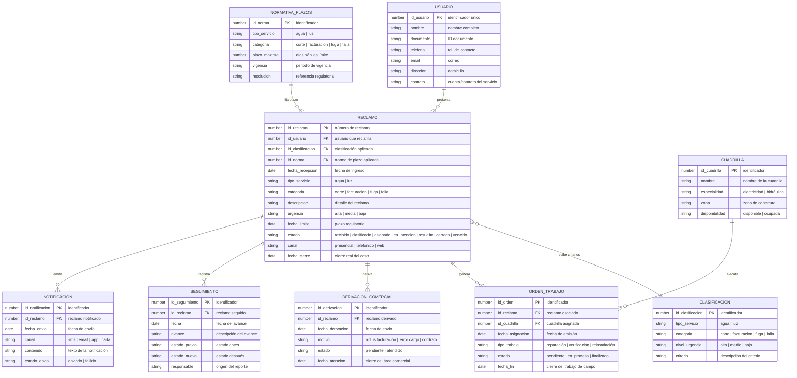

# DER: Diagrama Entidad-Relación — Sistema de Atención de Reclamos de Servicios Básicos

## Contexto

Modelo de datos para los almacenes comprendidos del sistema. Cubre el registro del usuario, el ciclo de vida del reclamo, la clasificación y normativa, la ejecución (técnica y comercial) y el seguimiento hasta el cierre.

## Diagrama

## Puntos Clave

- **RECLAMO es la entidad núcleo**: agrega la clasificación y el plazo (FK a CLASIFICACION y NORMATIVA_PLAZOS), y **alterna** entre la ejecución técnica (ORDEN_TRABAJO) y la comercial (DERIVACION_COMERCIAL), reflejando la regla de asignación exclusiva del dominio.
- **CUADRILLA y NORMATIVA_PLAZOS son datos de referencia** que existen con independencia del caso; el resto del modelo depende de RECLAMO.
- El **SEGUIMIENTO mantiene el historial inmutable** (estado_previo/estado_nuevo) para la trazabilidad regulatoria.
- Correspondencia con almacenes: USUARIO → AD: Usuarios · RECLAMO/CLASIFICACION/NORMATIVA → AD: Reclamos/Clasificaciones/Normativas · ORDEN_TRABAJO/CUADRILLA → AD: Ordenes de Trabajo/Cuadrillas · SEGUIMIENTO → AD: Seguimiento · NOTIFICACION → AD: Notificaciones.