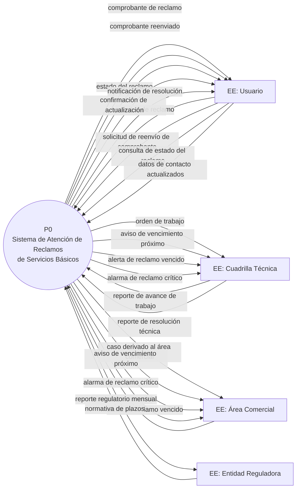

# DFD Nivel 0 (Diagrama de Contexto): Sistema de Atención de Reclamos de Servicios Básicos (Agua y Luz)

## Contexto y Análisis Previo

Diagrama de contexto que define la **frontera** del sistema frente a sus **Entidades Externas** (01-lista-eventos.md, §1–§2). Todas las entradas/salidas corresponden a los eventos de flujo (F1–F8); los eventos temporales (T1–T4) y de control (C1–C2) se materializan como salidas automáticas hacia las entidades responsables.

Representa al sistema completo como un único proceso `P0`.

## Diagrama

📌 Leyenda del Diagrama
[EE: ...] = Entidad Externa (actor/fuente/destino fuera del sistema)
P0((...)) = Proceso (transformación o acción del sistema)
[(AD: ...)] = Almacén de Datos (datos en reposo)
-->|...| = Flujo de Datos (información en movimiento)

## Puntos Clave

- La frontera excluye la **ejecución del trabajo de campo** (cuadrillas) y la **resolución material comercial**: solo sus reportes ingresan al sistema (eventos F5, F6, F7).
- La **normativa** viene de la Entidad Reguladora (F8); el sistema no la genera, solo la aplica.
- Los avisos de plazo (T1, T2) y la alarma crítica (C1) salen hacia la entidad responsable del caso (cuadrilla o área comercial), según la vía de atención determinada en la clasificación.
- El Usuario es un ciclo completo: *entra con el reclamo (F1) y sale con la notificación de resolución*; el comprobante (F1/F4) y el estado (F2) son salidas intermedias.