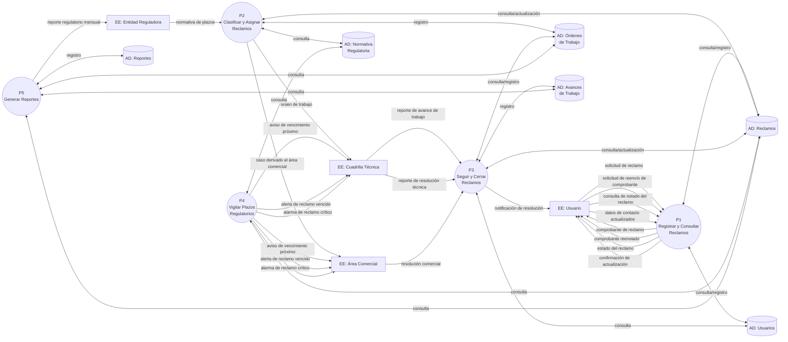

# DFD Nivel 1 (Subsistemas): Sistema de Atención de Reclamos de Servicios Básicos (Agua y Luz)

## Contexto y Análisis Previo

Descomposición del contexto (02-dfd-nivel-0.md) en **cinco subsistemas** que procesan los eventos de 01-lista-eventos.md. Los subsistemas se acoplan **exclusivamente mediante Almacenes de Datos** (regla de conservación de datos de Yourdon: flujos asíncronos requieren almacén intermedio).

- **P1** Registra/consulta reclamos y emite comprobantes (F1–F4).
- **P2** Clasifica, determina plazos y asigna/deriva (F8 + respuesta a F1).
- **P3** Registra avances, resoluciones, cierra y notifica (F5–F7).
- **P4** Vigila plazos y emite avisos/alarmas (T1, T2, C1).
- **P5** Genera reportes operativo y regulatorio (T3, T4).

## Diagrama

📌 Leyenda del Diagrama
[EE: ...] = Entidad Externa (actor/fuente/destino fuera del sistema)
P1((...)) = Proceso (transformación o acción del sistema)
[(AD: ...)] = Almacén de Datos (datos en reposo)
-->|...| = Flujo de Datos (información en movimiento)

## Puntos Clave

- **Balanceo con Nivel 0:** todos los flujos externos del contexto aparecen asignados a su subsistema (P1–P5); ninguna Entidad Externa se descompone.
- Los subsistemas **no intercambian flujos directos entre sí**: la separación es asíncrona mediante `AD: Reclamos` (P1 registra → P2/P3/P4/P5 consultan), `AD: Órdenes de Trabajo` (P2 asigna → P3 da seguimiento) y `AD: Normativa Regulatoria` (P2 mantiene → P4 consulta).
- **P4** materializa los eventos temporales/control (T1, T2, C1) como salidas automáticas hacia la entidad responsable del caso.
- **P5** produce el reporte regulatorio (T4) hacia la Entidad Reguladora; el reporte operativo (T3) queda archivado en `AD: Reportes`.