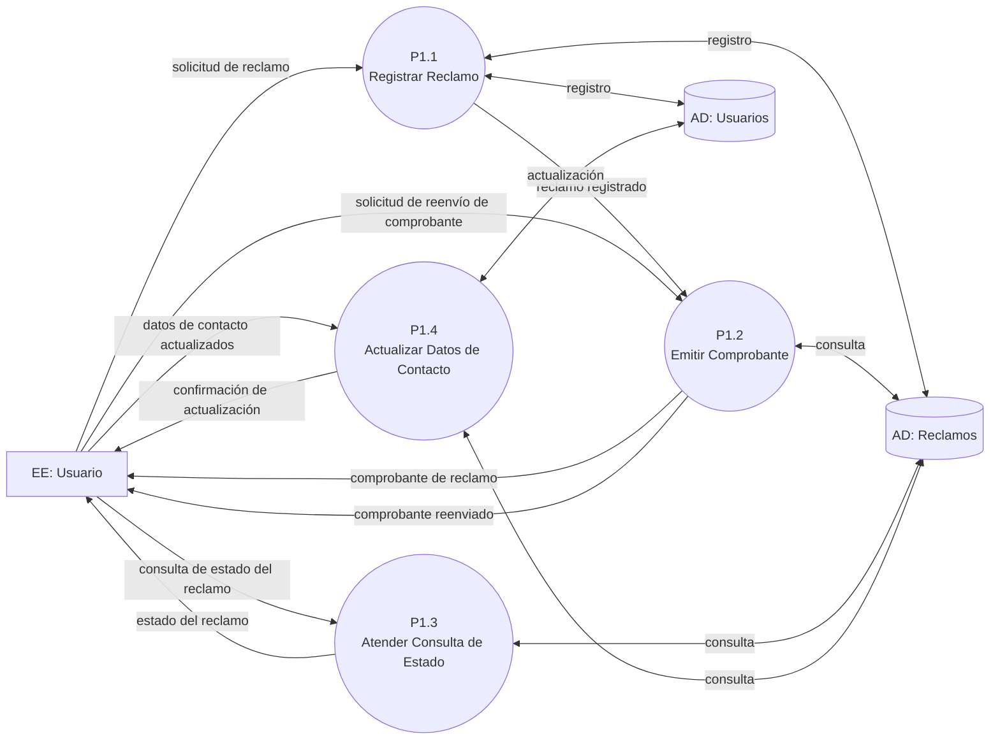
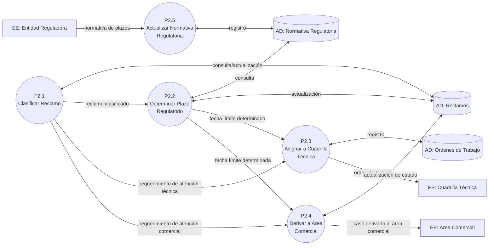
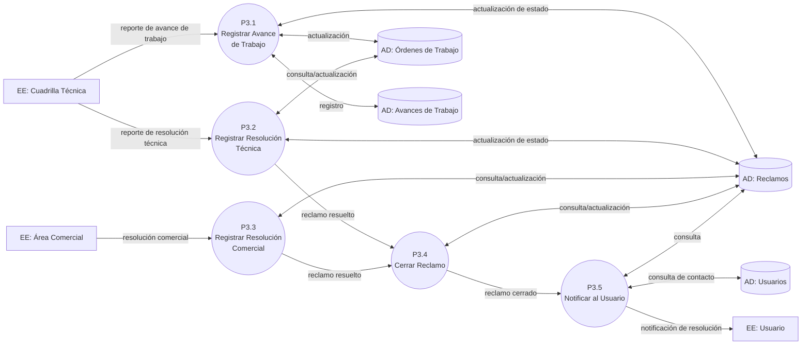
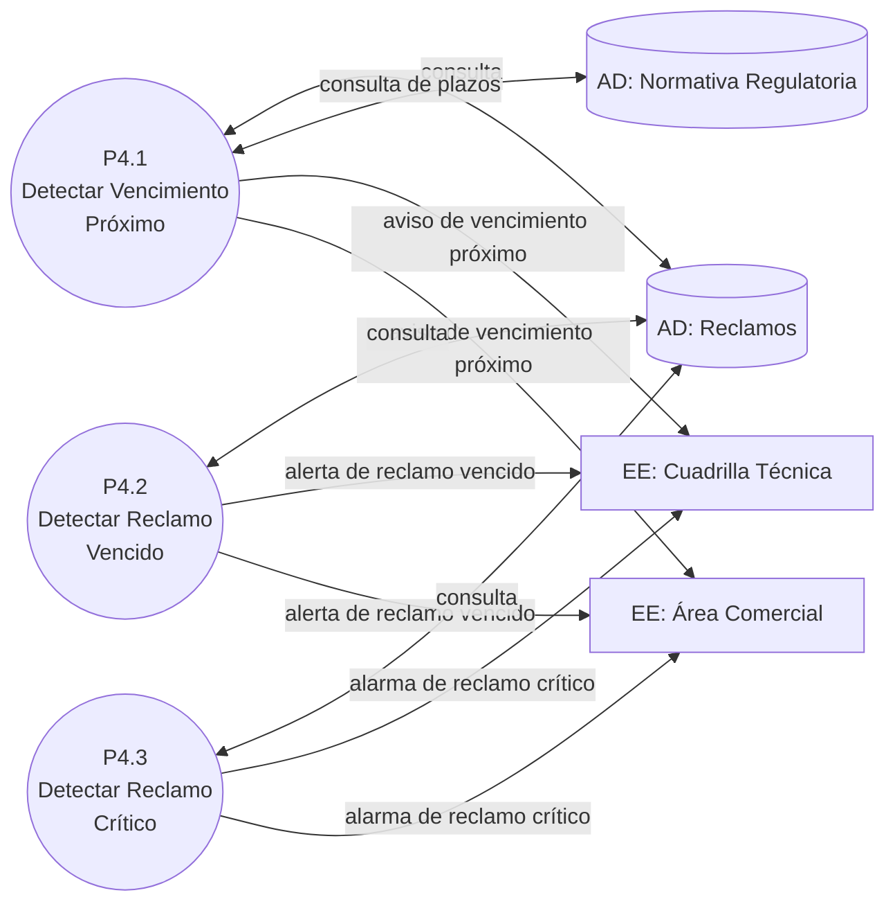
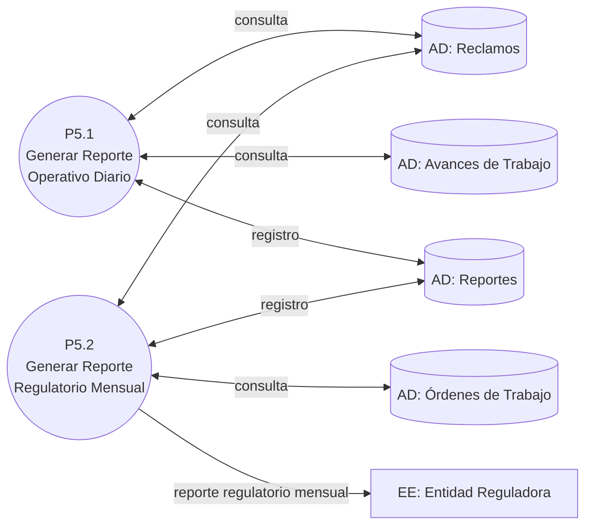

# DFD Nivel 2 (Funciones): Sistema de Atención de Reclamos de Servicios Básicos (Agua y Luz)

## Contexto y Análisis Previo

Descomposición de cada subsistema del Nivel 1 (03-dfd-nivel-1.md) en sus **funciones** (P1.x–P5.x). Cada diagrama respeta el **balanceo estricto**: todo flujo de entrada/salida del proceso padre aparece en el diagrama hijo, y los Almacenes de Datos conservan el mismo nombre en todos los niveles.

## Diagrama 1: P1 — Registrar y Consultar Reclamos

📌 Leyenda del Diagrama
[EE: ...] = Entidad Externa (actor/fuente/destino fuera del sistema)
P1.1((...)) = Proceso (transformación o acción del sistema)
[(AD: ...)] = Almacén de Datos (datos en reposo)
-->|...| = Flujo de Datos (información en movimiento)

### Puntos Clave (P1)

- Balanceo con Nivel 1: todas las entradas del Usuario (fechas F1–F4) y sus salidas (comprobante, estado, confirmación) están presentes.
- El registro y la emisión del comprobante están separados: P1.1 produce el *reclamo registrado* y P1.2 lo convierte en comprobante (lectura sobre `AD: Reclamos`).
- El reenvío de comprobante (F4) reutiliza el mismo proceso P1.2, sin duplicar lógica.

## Diagrama 2: P2 — Clasificar y Asignar Reclamos

📌 Leyenda del Diagrama
[EE: ...] = Entidad Externa (actor/fuente/destino fuera del sistema)
P2.1((...)) = Proceso (transformación o acción del sistema)
[(AD: ...)] = Almacén de Datos (datos en reposo)
-->|...| = Flujo de Datos (información en movimiento)

### Puntos Clave (P2)

- La clasificación (P2.1) es previa y **condiciona la vía de atención**: técnica (corte, fuga, falla) o comercial (facturación).
- El plazo regulatorio (P2.2) se determina leyendo `AD: Normativa Regulatoria` y se persiste en `AD: Reclamos` para el posterior monitoreo temporal de P4.
- **Asignación (P2.3)** y **derivación (P2.4)** son mutuamente excluyentes: un reclamo sigue una única vía; de ahí que las relaciones en el DER sean 0..1.
- P2.5 recibe la normativa (evento F8) y la incorpora al almacén; las actualizaciones solo afectan reclamos nuevos.

## Diagrama 3: P3 — Seguir y Cerrar Reclamos

📌 Leyenda del Diagrama
[EE: ...] = Entidad Externa (actor/fuente/destino fuera del sistema)
P3.1((...)) = Proceso (transformación o acción del sistema)
[(AD: ...)] = Almacén de Datos (datos en reposo)
-->|...| = Flujo de Datos (información en movimiento)

### Puntos Clave (P3)

- Los avances (P3.1) se acumulan sobre la orden técnica (`AD: Avances de Trabajo`) y reflejan el estado parcial en `AD: Reclamos`.
- La **resolución** (técnica P3.2 o comercial P3.3) alimenta el **cierre** (P3.4), que es un único proceso de estado en el reclamo.
- La **notificación** (P3.5) lee el contacto del usuario desde `AD: Usuarios`, separando la comunicación de la lógica de cierre.

## Diagrama 4: P4 — Vigilar Plazos Regulatorios

📌 Leyenda del Diagrama
[EE: ...] = Entidad Externa (actor/fuente/destino fuera del sistema)
P4.1((...)) = Proceso (transformación o acción del sistema)
[(AD: ...)] = Almacén de Datos (datos en reposo)
-->|...| = Flujo de Datos (información en movimiento)

### Puntos Clave (P4)

- Es la respuesta a los **eventos temporales y de control** (T1, T2, C1 de 01-lista-eventos.md): no espera entrada externa, se dispara por el paso del tiempo.
- Todo reclamo es evaluado contra su `fecha_tope` (almacenada por P2.2) y la normativa vigente (`AD: Normativa Regulatoria`).
- Los avisos se dirigen a la **entidad responsable del caso** (cuadrilla o área comercial), nunca fuera de la frontera definida.

## Diagrama 5: P5 — Generar Reportes

📌 Leyenda del Diagrama
[EE: ...] = Entidad Externa (actor/fuente/destino fuera del sistema)
P5.1((...)) = Proceso (transformación o acción del sistema)
[(AD: ...)] = Almacén de Datos (datos en reposo)
-->|...| = Flujo de Datos (información en movimiento)

### Puntos Clave (P5)

- Procesos temporales puros (T3, T4): se ejecutan en horario programado y leen exclusivamente de los almacenes operativos; no reciben flujos de las demás funciones.
- El **reporte operativo diario** (T3) queda archivado en `AD: Reportes` para consumo interno; el **reporte regulatorio mensual** (T4) se entrega a la Entidad Reguladora.
- Ninguna función escribe sobre los almacenes operativos (solo leen), preservando la integridad del registro de reclamos.