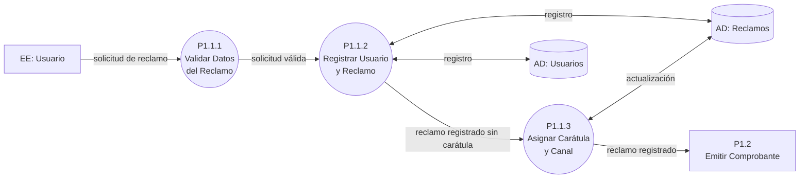
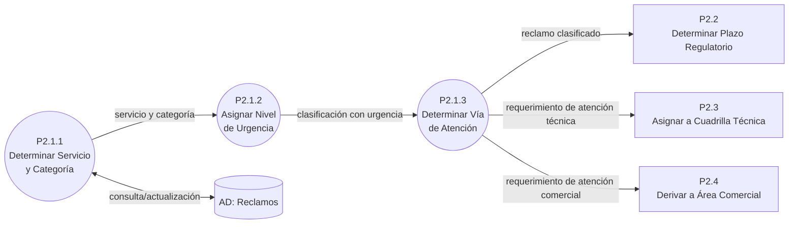
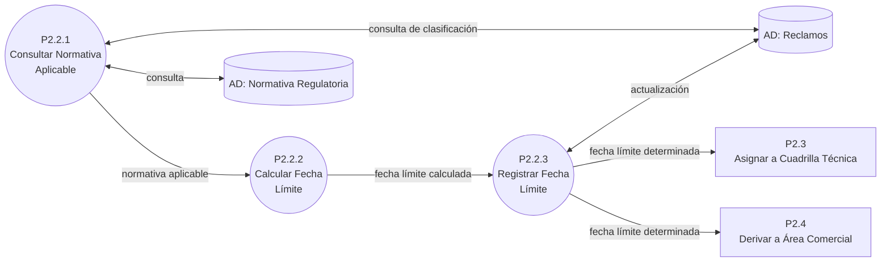
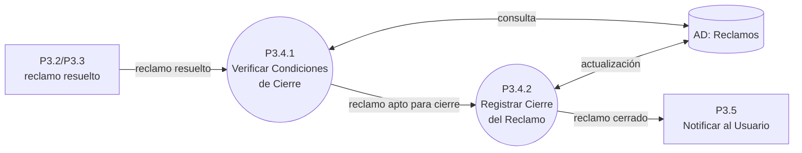

# DFD Nivel 3 (Subfunciones): Sistema de Atención de Reclamos de Servicios Básicos (Agua y Luz)

## Contexto y Análisis Previo

Descomposición de las funciones del Nivel 2 (04-dfd-nivel-2.md) que requieren mayor detalle lógico. Las funciones restantes (P1.2, P1.3, P1.4, P2.3–P2.5, P3.1–P3.5, P4.1–P4.3, P5.1–P5.2) ya son **procesos atómicos** y se especifican directamente en 09-especificaciones.md.

> Dado que esta descomposición alcanza procesos atómicos sin forzar un Nivel 4, el archivo **06-dfd-primitivos.md no aplica** en esta actividad; los procesos primitivos se consolidan y especifican en 09-especificaciones.md.

## Diagrama 1: P1.1 — Registrar Reclamo

📌 Leyenda del Diagrama
[EE: ...] = Entidad Externa (actor/fuente/destino fuera del sistema)
P1.1.1((...)) = Proceso (transformación o acción del sistema)
[(AD: ...)] = Almacén de Datos (datos en reposo)
-->|...| = Flujo de Datos (información en movimiento)

### Puntos Clave (P1.1)

- Balanceo con P1.1 del Nivel 2: la entrada `solicitud de reclamo` (U), la salida `reclamo registrado` (a P1.2) y los almacenes `AD: Usuarios` / `AD: Reclamos` se conservan.
- `P1.2` aparece como **nodo de referencia** (balanceo) en el flujo de salida, no como subfunción de este nivel.
- La carátula (número único + canal de ingreso) se asigna después del registro físico (P1.1.3), sobre `AD: Reclamos`.

## Diagrama 2: P2.1 — Clasificar Reclamo

📌 Leyenda del Diagrama
[EE: ...] = Entidad Externa (actor/fuente/destino fuera del sistema)
P2.1.1((...)) = Proceso (transformación o acción del sistema)
[(AD: ...)] = Almacén de Datos (datos en reposo)
-->|...| = Flujo de Datos (información en movimiento)

### Puntos Clave (P2.1)

- Balanceo con P2.1 del Nivel 2: lectura/actualización de `AD: Reclamos` y las tres salidas (`reclamo clasificado` a P2.2, `requerimiento de atención técnica` a P2.3, `requerimiento de atención comercial` a P2.4) se conservan.
- La **urgencia** (P2.1.2) es resultado de reglas sobre servicio, categoría y el relato del usuario (matriz en 09-especificaciones.md, P2.1.2).
- La **vía de atención** (P2.1.3) es una decisión del sistema: técnica para corte/fuga/falla; comercial para facturación.

## Diagrama 3: P2.2 — Determinar Plazo Regulatorio

📌 Leyenda del Diagrama
[EE: ...] = Entidad Externa (actor/fuente/destino fuera del sistema)
P2.2.1((...)) = Proceso (transformación o acción del sistema)
[(AD: ...)] = Almacén de Datos (datos en reposo)
-->|...| = Flujo de Datos (información en movimiento)

### Puntos Clave (P2.2)

- Balanceo con P2.2 del Nivel 2: entradas (`reclamo clasificado` desde P2.1), almacenes (`AD: Normativa Regulatoria`, `AD: Reclamos`) y salidas (`fecha límite determinada` a P2.3/P2.4) se conservan.
- La consulta (P2.2.1) selecciona la normativa por **servicio + categoría + urgencia** y vigencia vigente; el cálculo (P2.2.2) suma `plazo_maximo_dias` a la fecha de recepción.
- La persistencia (P2.2.3) deja la `fecha_tope` disponible para el monitoreo de P4.

## Diagrama 4: P3.4 — Cerrar Reclamo

📌 Leyenda del Diagrama
[EE: ...] = Entidad Externa (actor/fuente/destino fuera del sistema)
P3.4.1((...)) = Proceso (transformación o acción del sistema)
[(AD: ...)] = Almacén de Datos (datos en reposo)
-->|...| = Flujo de Datos (información en movimiento)

### Puntos Clave (P3.4)

- Balanceo con P3.4 del Nivel 2: entrada `reclamo resuelto` (desde P3.2/P3.3), almacén `AD: Reclamos` y salida `reclamo cerrado` (a P3.5) se conservan.
- La **verificación** (P3.4.1) valida que exista resolución registrada, que no existan observaciones pendientes y que los avances estén completos.
- El **registro** (P3.4.2) fija el estado `cerrado` y la `fecha_cierre`, que alimenta el cumplimiento de plazos y los reportes (P5).