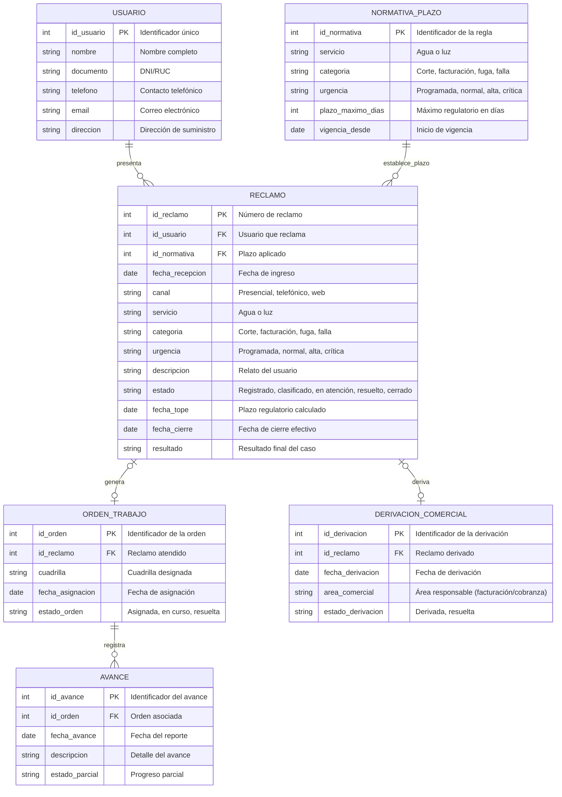

# DER (Modelo de Datos): Sistema de Atención de Reclamos de Servicios Básicos (Agua y Luz)

## Contexto y Análisis Previo

Modelo de **Información** independiente del DFD (Modelo de Comportamiento). Se deriva de los Almacenes de Datos estabilizados en 03-dfd-nivel-1.md: `AD: Usuarios`, `AD: Reclamos`, `AD: Normativa Regulatoria`, `AD: Órdenes de Trabajo`, `AD: Avances de Trabajo` y `AD: Reportes`.

Decisiones de diseño:
- Un reclamo es **técnico o comercial**, no ambos: la asignación a cuadrilla (`ORDEN_TRABAJO`) y la derivación comercial (`DERIVACION_COMERCIAL`) son **alternativas mutuamente excluyentes** (0..1 en ambos casos).
- La normativa es un catálogo vigente que **establece el plazo** de cada reclamo según servicio + categoría + urgencia.
- Los avances solo existen vinculados a una orden de trabajo técnica.

## Diagrama

📌 Leyenda del Diagrama
USUARIO = Entidad (tabla/almacén de datos)
||--o{ ∪ = Cardinalidad 1:N (uno a muchos)
o|--o| = Cardinalidad 0..1:0..1 (opcional)
PK = Clave primaria · FK = Clave foránea

## Puntos Clave

- **Modelo independiente:** el DER no es un nivel del DFD; describe la estructura estática de los almacenes identificados en el comportamiento.
- La excluyencia técnica/comercial se captura con dos relaciones opcionales desde `RECLAMO` y una regla de negocio documentada en 09-especificaciones.md (P2.1.3).
- `NORMATIVA_PLAZO` se relaciona con `RECLAMO` (1:N) porque cada reclamo recibe exactamente una regla vigente al momento de su clasificación.
- `AVANCE` depende existencialmente de `ORDEN_TRABAJO` (composición 1:N): sin orden técnica no existen avances.
- La cardinalidad 0..1 en `DERIVACION_COMERCIAL` permite que el cierre del reclamo se evalúe sobre el propio estado del registro sin entidades intermedias adicionales.